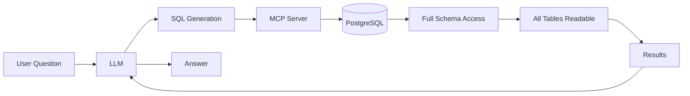
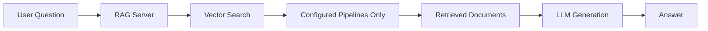

# Choosing the Right Solution

This guide helps you decide between the pgEdge MCP Server (this project) and the
[pgEdge RAG Server](https://github.com/pgedge/pgedge-rag-server) for your
application.

!!! danger "Critical Security Consideration"
    **The MCP Server should NOT be used in public-facing applications.** When
    connected to an LLM, it provides unrestricted read access to your entire
    database, potentially exposing sensitive implementation details to
    end users.

## Overview

pgEdge offers two complementary approaches for natural language database
interaction:

| Feature | MCP Server | RAG Server |
|---------|------------|------------|
| **Primary Use Case** | Internal tools, development | Public-facing applications |
| **Data Access** | Full database (read-only) | Pre-configured pipelines only |
| **Schema Exposure** | Complete schema visible to LLM | No schema exposure |
| **Query Type** | Natural language to SQL | Semantic search over documents |
| **Integration** | MCP protocol (Claude Desktop, etc.) | REST API |

## MCP Server: When to Use

The MCP Server is ideal for:

- **Developer tools** - Query databases using natural language during
  development
- **Internal dashboards** - Business intelligence for trusted employees
- **Database exploration** - Understanding schema and data relationships
- **Administrative tasks** - Monitoring and troubleshooting databases
- **AI-assisted development** - Integration with Claude Desktop or similar
  tools

### Advantages

- Full database exploration capability
- Schema-aware query generation
- System monitoring via PostgreSQL statistics
- Rich tool ecosystem (query, schema analysis, search)
- Direct integration with MCP-compatible clients

### Security Implications

When the MCP Server is connected to an LLM and exposed to users, the LLM has
the ability to:

- **Read any table** in the connected database
- **Explore the complete schema**, including table names, column names, data
  types, and relationships
- **Access PostgreSQL system views**, revealing server configuration and
  statistics
- **Infer application architecture** from naming conventions and table
  structures
- **Discover sensitive patterns** such as user tables, authentication schemas,
  or business logic encoded in the data model

Even with read-only protection, this level of access is inappropriate for
public-facing applications where end users could:

- Learn implementation details of your application
- Discover internal table structures and column names
- Infer business logic from data relationships
- Find potential attack vectors by understanding your schema
- Access data they shouldn't see through carefully crafted queries

## RAG Server: When to Use

The [pgEdge RAG Server](https://github.com/pgedge/pgedge-rag-server) is
designed for:

- **Customer-facing applications** - Chatbots, help systems, search interfaces
- **Public documentation** - Searchable knowledge bases
- **Product features** - AI-powered search within your application
- **Controlled data access** - Expose only specific content to users

### Advantages

- **No schema exposure** - LLM only sees document content, not database
  structure
- **Pipeline-based access** - Pre-configure exactly what data is searchable
- **Hybrid search** - Combines vector similarity with BM25 text matching
- **Token budget control** - Manage costs with configurable limits
- **Streaming responses** - Real-time output via Server-Sent Events
- **Multiple providers** - OpenAI, Anthropic, Voyage, Ollama support

### How It Works

The RAG Server uses a fundamentally different approach:

1. **Pre-configured pipelines** define which tables/columns are searchable
2. **Vector embeddings** enable semantic search over document content
3. **Retrieval** finds relevant documents based on user queries
4. **Generation** produces answers using only the retrieved context

The LLM never sees your schema, table names, or raw SQL - it only receives
document fragments relevant to the user's question.

## Decision Guide

### Choose MCP Server if:

- Users are developers or trusted internal staff
- You need full database exploration capabilities
- Integration with Claude Desktop or MCP clients is required
- Schema visibility is acceptable or desired
- The application runs in a controlled, internal environment

### Choose RAG Server if:

- End users are external customers or the general public
- You need to expose only specific, curated content
- Schema and implementation details must remain hidden
- You're building a customer-facing search or chat feature
- Fine-grained control over accessible data is required

### Consider Both if:

- Developers use MCP Server internally for exploration and debugging
- Production customer features use RAG Server for controlled access
- Different user populations have different trust levels

## Architecture Comparison

### MCP Server Architecture

The LLM has context about your entire schema and can query any table.

### RAG Server Architecture

The LLM only sees document fragments from pre-approved data sources.

## Summary

| Aspect | MCP Server | RAG Server |
|--------|------------|------------|
| **Trust Level Required** | High (internal users) | Low (public users) |
| **Data Exposure Risk** | High (full schema) | Low (controlled pipelines) |
| **Query Flexibility** | High (any SQL query) | Medium (semantic search) |
| **Setup Complexity** | Low (connect and go) | Medium (configure pipelines) |
| **Best For** | Development, internal tools | Production, public features |

!!! tip "Recommendation"
    For most production applications with external users, start with the
    RAG Server. Use the MCP Server for internal development and administrative
    tasks where full database access is appropriate and users are trusted.

## Related Resources

- [pgEdge RAG Server Documentation](https://github.com/pgedge/pgedge-rag-server)
- [Security Guide](security.md) - Security best practices for MCP Server
- [Authentication Guide](authentication.md) - Access control configuration
